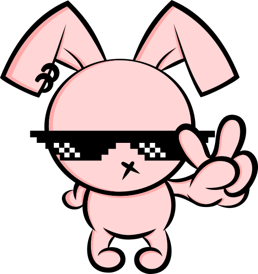

<p align="center">
  
  <h3 align="center">PR Maneiro 👍🏻</h3>
  <p align="center">Faça alguém feliz com um comentário no PR!</p>
  <p align="center">
    
    
    <a href="http://picpay.me/igorhalfeld">
      
    </a>
  </p>
</p>

> ⚠️ Em ativo desenvolvimento

[**Versão 2 esta sendo desenvolvida, veja aqui**](https://github.com/IgorHalfeld/pr-maneiro/pull/72)

### Templates já disponíveis

- Arnaldo Cezar Coelho
- Big Smoke
- Cabo Daciolo
- Carlos Bolsonaro
- Celso Portiolli
- Charlie Brown Jr
- Chaves
- Dado Dolabella
- Darth Vader
- Datena
- Davy Jones
- Dilma Rousseff
- Donald J. Trump
- Erick Jacquin
- Everson Zóio
- Faustão
- Filipe Deschamps
- Galvão Bueno
- Gil Brother
- Jailson Mendes
- Jair M. Bolsonaro
- Joel Santana
- Julius - Everybody Hates Chris
- Kid Bengala
- Kléber Bambam
- Maike da S.W.A.T
- Marcus Cirillo
- Mano Brown
- Marília Gabriela
- Marina Silva
- Neymar Jr
- Nego Di
- Padre Marcelo Rossi
- Pedro Bial
- PC Siqueira
- Professor Raimundo
- Ronaldinho Gaúcho
- Stevie Wonder
- Um Pistoleiro chamado Papaco
- Vampeta
- Yudi Tamashiro
- Zeca Pagodinho
- Xandão

## Setup

```sh
# install docs
npm install

# Compiles and hot-reloads for development
npm run serve

# Compiles and minifies for production
npm run build

# Run your unit tests
npm run test:unit

# Run your end-to-end tests
npm run test:e2e

# Lints and fixes files
npm run lint
```
